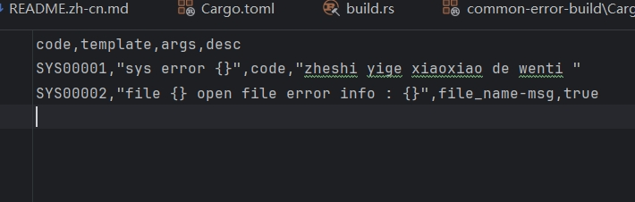

# Common-error: High performance universal error code management for Rust

English | [简体中文](README)

## Overview

Common-error is a High performance universal error code management for **Rust**.

Provide a build to parse common-error.cvs in crate and convert it into a rust file.

All parsing and conversion processes are generated into code in advance to achieve a certain degree of high performance.

## Brief



- **High Performance**: Literal assembly that generates error messages in advance during the build phase
- **Easy Manager**: Manage error codes through file control

## Quick Start

step 1  : Introducing dependencies in crate
```chatinput
[build-dependencies]
common-error-buld = "0.1.0"

[dependencies]
common-error = "0.1.0"
```
step 2 : build script call `error_build` function.
step 3 : Maintain your common-error.csv .

## License

This project is licensed under the [Apache 2.0 license](LICENSE).
