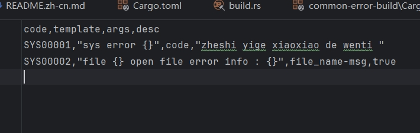
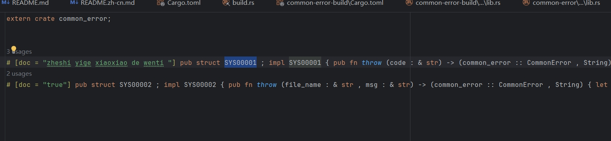
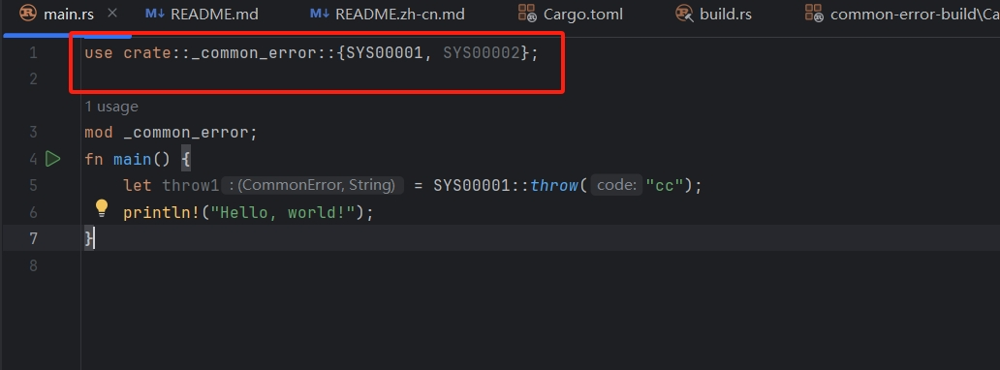
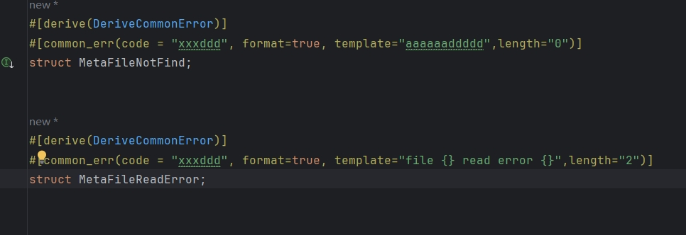

# common-error：Rust 的高性能通用错误码管理

[英文](README.en) | 简体中文

## 概述

通用错误码是为 **Rust** 提供的高性能通用错误码管理工具。

提供一个构建过程，用于解析 crate 中的 common-error.csv 并将其转换为 rust 文件。

所有解析和转换过程都会提前生成代码，以实现一定程度的高性能。

## 简介



- **高性能**：在构建阶段预先生成错误消息的字面量代码以及函数。
- **易于管理**：通过文件控制管理错误码

## 问题
本项目存在以下问题，请谨慎选择使用。
- **生成的代码未格式化**：因为错误码数量很多，因此进行单行显示。



- **需要手动引入**：因为include文件在宏展示时，顺序和编译顺序冲突，可能导致crate编译失败因此需要手动引入。


- **为什么不用宏**：因为使用宏不利于统一维护，如果有需要可以邮件联系我。下面图片是使用宏的状态
  

- **xml、toml、properties的支持**：目前数据结构校验已经打通，如果有需要的可以邮件联系我。
- 
- **handle_error!** 目前硬性约定,最后一位参数是给err.to_string(). 目前没有找到好的展开方案, 留msg标签的方案使用过于复杂,且先将占位作为约定.
> 作者一直喜欢的编程理论是，看着简单，听着也很简单就是最好的方案。一直以此方式维护自己的项目，因此基于个人觉得不算好的的写法就没有收录进去。
> 本项目对工程部残生额外依赖，改造简单可以做各类适应性改造。


## 快速开始

步骤 1：在 crate 中引入依赖
```chatinput
[build-dependencies]
common-error-build = "0.1.0"

[dependencies]
common-error = "0.1.0"
```

步骤 2：构建脚本调用 `error_build` 函数。
步骤 3：维护你的 common-error.csv 文件。
步骤 4：在你的crate 中引入 `_common_error` mod,抛出异常.
```chatinput
struct LOC00007;
fn main(){
    common_error::handle_error!(result: Result::Ok(""), etype: LOC00007, "x".clone() ,"y".clone());
}
```


## 许可证

本项目采用 [Apache 2.0 许可证](LICENSE) 授权。
